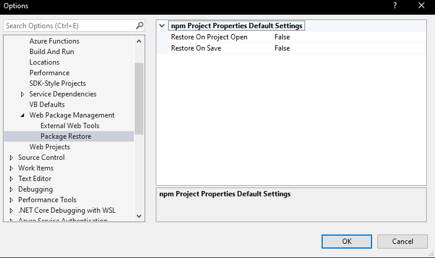

# Yarn Installer 2022

IMPORTANT : This project is an adaptation of [Mads Kristensen's](https://github.com/madskristensen) [Yarn Installer project](https://github.com/madskristensen/YarnInstaller) to adapt it to VS 2022.

Download this extension from the [VS Marketplace](https://marketplace.visualstudio.com/items?itemName=MadsKristensen.YarnInstaller)
or get the [CI build](http://vsixgallery.com/extension/54ec7bf0-19bb-467f-a5a5-15ad0492653b/).

---------------------------------------

Makes it easy to restore npm packages using Yarn from within Visual Studio

## Prerequisite
You need to install [Yarn](https://yarnpkg.com/) in order for this extension to work.

## Description
### Options available
Automatically run `yarn install` when saving *package.json* by enabling it in the **Tools -> Options** dialog.

Remember to disable the built-in `npm restore` when you do this (see below).

## Disable npm restore
By default Visual Studio will call `npm install` when *package.json* is saved and also when a project containing a *package.json* file is being opened.

To turn off the automatic calls to `npm install`, disable them in the **Tools -> Options** dialog.

## License
[Apache 2.0](LICENSE)